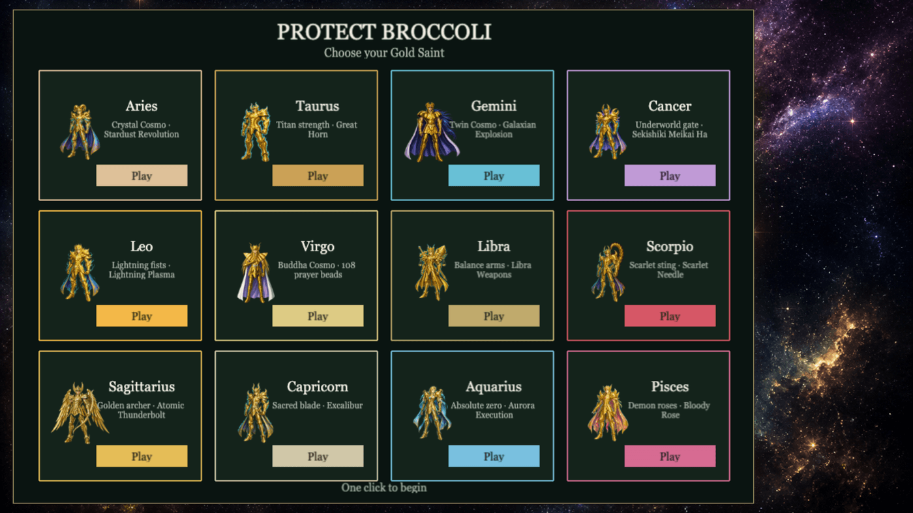

# Protect Broccoli

Defend Athena’s broccoli patch for two minutes as a Gold Saint.

**Play:** [protect-broccoli-929315648024.us-central1.run.app](https://protect-broccoli-929315648024.us-central1.run.app)



Pests are coming for the broccoli. Pick a Gold Saint, hold the patch until Athena wakes, and don’t let it get eaten.

## How to play

| Control | Action |
| --- | --- |
| Left click | Move |
| Double left click | Attack |
| Space | Attack |
| Right click | Special (charges over time) |
| R | Quit to select |

Skip the roster with `?hero=aries` (or any other house id).

## Gold Saints

| House | Special |
| --- | --- |
| Aries | Stardust Revolution |
| Taurus | Great Horn |
| Gemini | Galaxian Explosion |
| Cancer | Sekishiki Meikai Ha |
| Leo | Lightning Plasma |
| Virgo | Tenbu Horin |
| Libra | Libra Weapons |
| Scorpio | Scarlet Needle |
| Sagittarius | Atomic Thunderbolt |
| Capricorn | Excalibur |
| Aquarius | Aurora Execution |
| Pisces | Bloody Rose |

## Run locally

```bash
npm install
npm run dev
```

Then open the Vite URL (default `http://localhost:5173`).

```bash
npm run build
npm run preview
```

## Deploy

The game is a Vite static build served by nginx on Cloud Run.

```bash
gcloud run deploy protect-broccoli \
  --source . \
  --region us-central1 \
  --allow-unauthenticated \
  --port 8080 \
  --memory 256Mi
```
